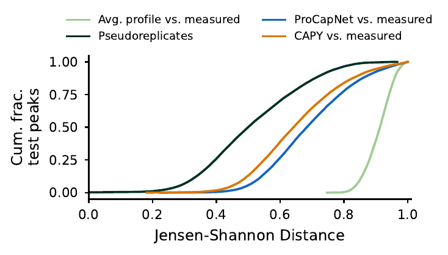
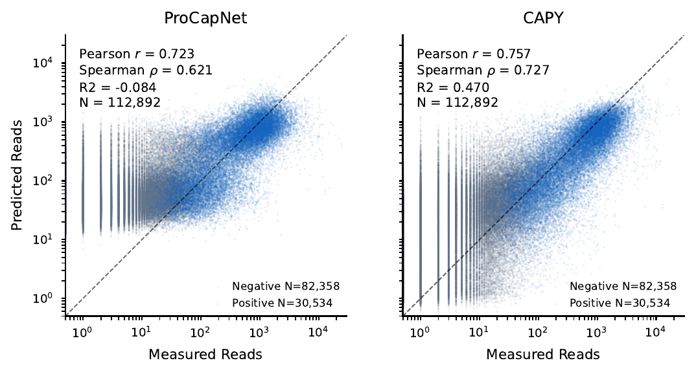
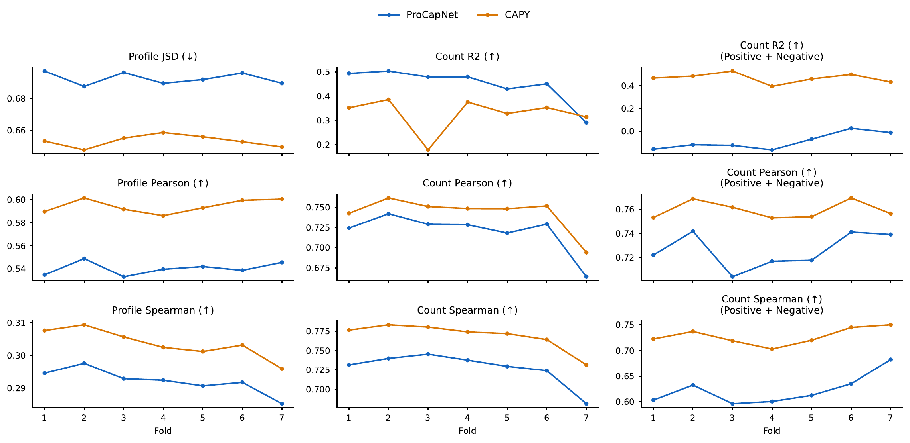

# PRO-cap Results Report

## Summary

This report summarizes CAPY and ProCapNet performance on the K562 PRO-cap
benchmark used by the scripts in this directory. Across seven test folds, the
default CAPY model improved profile prediction and combined
positive/negative count prediction relative to the local ProCapNet baseline.
Within CAPY, Y-net and U-net count heads had similar profile performance. Count
metrics depended more on the count head design, with the MLP heads generally
outperforming the linear heads in these ablations.

All values below are fold mean +/- sample standard deviation across seven test
folds. JSD is lower-is-better; Pearson, Spearman, and R2 are higher-is-better.
Test-time reverse-complement augmentation is applied.

## Benchmark Setup

The benchmark uses processed K562 PRO-cap data with seven folds and evaluates
the held-out test split. Profile metrics are computed on stranded
base-resolution output profiles. Count metrics are computed from predicted and
observed log total counts for three peak sets:

| Split | Meaning | Number of examples |
| --- | --- | ---: |
| Positive peaks | PRO-cap peak test regions | 30,534 |
| Negative peaks | DNase peak but PRO-cap no-peak test regions | 82,358 |
| Positive + negative peaks | Combined regions | 112,892 |

## Models

| Model | Description |
| --- | --- |
| ProCapNet | BPNet-style baseline with dilated convolution trunk and profile/count heads. |
| CAPY/Y-net | Default CAPY model: decoder profile head, count head on the bottleneck. |
| CAPY/Y-net MLP | CAPY model with an encoder-sourced Y-net count branch and an MLP count head. |
| CAPY/Y-net Linear | CAPY model with a Y-net count branch and a linear count head. |
| CAPY/U-net MLP | CAPY model with a decoder-sourced U-net count head and an MLP count head. |
| CAPY/U-net Linear | CAPY model with a decoder-sourced U-net count head and a linear count head. |

## ProCapNet vs CAPY/Y-net

CAPY/Y-net improved the profile metrics over ProCapNet in this run. The count
comparison was split-dependent: CAPY/Y-net improved count correlations on
positive peaks and improved all reported metrics on negative and combined
positive/negative peaks, while positive-peak count R2 was lower than ProCapNet.

### Profile Metrics

| Metric | ProCapNet | CAPY/Y-net | CAPY change |
| --- | ---: | ---: | ---: |
| JSD (↓) | 0.693 +/- 0.004 | **0.653 +/- 0.004** | -0.039 |
| Pearson (↑) | 0.540 +/- 0.006 | **0.595 +/- 0.006** | +0.054 |
| Spearman (↑) | 0.292 +/- 0.004 | **0.304 +/- 0.004** | +0.011 |

### Count Metrics

| Split | Metric | ProCapNet | CAPY/Y-net | CAPY change |
| --- | --- | ---: | ---: | ---: |
| Positive peaks | Pearson | 0.719 +/- 0.025 | **0.743 +/- 0.022** | +0.023 |
| Positive peaks | Spearman | 0.727 +/- 0.021 | **0.769 +/- 0.018** | +0.042 |
| Positive peaks | R2 | **0.446 +/- 0.073** | 0.327 +/- 0.070 | -0.120 |
| Negative peaks | Pearson | 0.358 +/- 0.033 | **0.499 +/- 0.018** | +0.141 |
| Negative peaks | Spearman | 0.324 +/- 0.037 | **0.492 +/- 0.017** | +0.168 |
| Negative peaks | R2 | -2.892 +/- 0.312 | **-0.789 +/- 0.170** | +2.102 |
| Positive + negative peaks | Pearson | 0.726 +/- 0.015 | **0.759 +/- 0.007** | +0.033 |
| Positive + negative peaks | Spearman | 0.623 +/- 0.030 | **0.728 +/- 0.017** | +0.105 |
| Positive + negative peaks | R2 | -0.087 +/- 0.073 | **0.467 +/- 0.044** | +0.554 |

## CAPY Count Head Ablation

The four CAPY variants had very similar profile metrics. For count prediction,
the MLP heads were stronger than the linear heads in both the Y-net and U-net
settings. The U-net MLP head had the strongest combined positive/negative count
Pearson, while the Y-net MLP head had the strongest combined
positive/negative count Spearman and R2 in this comparison.

### Profile Metrics

| Metric | CAPY/Y-net MLP | CAPY/Y-net Linear | CAPY/U-net MLP | CAPY/U-net Linear |
| --- | ---: | ---: | ---: | ---: |
| JSD | 0.653 +/- 0.003 | **0.653 +/- 0.008** | 0.654 +/- 0.005 | 0.655 +/- 0.006 |
| Pearson | 0.594 +/- 0.005 | **0.595 +/- 0.011** | 0.592 +/- 0.007 | 0.592 +/- 0.009 |
| Spearman | **0.304 +/- 0.004** | 0.303 +/- 0.005 | 0.303 +/- 0.004 | 0.303 +/- 0.005 |

### Count Metrics

| Split | Metric | CAPY/Y-net MLP | CAPY/Y-net Linear | CAPY/U-net MLP | CAPY/U-net Linear |
| --- | --- | ---: | ---: | ---: | ---: |
| Positive peaks | Pearson | **0.736 +/- 0.019** | 0.712 +/- 0.021 | 0.736 +/- 0.022 | 0.732 +/- 0.024 |
| Positive peaks | Spearman | 0.762 +/- 0.017 | 0.737 +/- 0.018 | **0.763 +/- 0.017** | 0.761 +/- 0.018 |
| Positive peaks | R2 | 0.325 +/- 0.059 | 0.296 +/- 0.049 | **0.327 +/- 0.087** | 0.317 +/- 0.085 |
| Negative peaks | Pearson | **0.497 +/- 0.017** | 0.489 +/- 0.018 | 0.493 +/- 0.016 | 0.497 +/- 0.020 |
| Negative peaks | Spearman | **0.493 +/- 0.016** | 0.475 +/- 0.018 | 0.486 +/- 0.017 | 0.488 +/- 0.020 |
| Negative peaks | R2 | **-0.878 +/- 0.177** | -1.046 +/- 0.186 | -0.893 +/- 0.185 | -0.900 +/- 0.158 |
| Positive + negative peaks | Pearson | 0.754 +/- 0.011 | 0.742 +/- 0.014 | **0.760 +/- 0.008** | 0.758 +/- 0.018 |
| Positive + negative peaks | Spearman | **0.726 +/- 0.016** | 0.713 +/- 0.017 | 0.723 +/- 0.016 | 0.723 +/- 0.018 |
| Positive + negative peaks | R2 | **0.443 +/- 0.049** | 0.396 +/- 0.049 | 0.439 +/- 0.047 | 0.437 +/- 0.037 |

## Interpretation

The main result is that CAPY performed better than the ProCapNet
baseline on both profile prediction and the combined count benchmark. The main
exception is positive-peak count R2, where ProCapNet was higher even though
CAPY/Y-net had higher positive-peak count Pearson and Spearman. The count
scatter plots suggest why this can happen: ProCapNet does not extend its count
predictions into the lower range occupied by negative regions, despite those
negative regions being included during training. This pattern is consistent with
a positive-peak-biased count model that assigns elevated activity to regions
without measured PRO-cap peaks.

The architecture ablation suggests that count-head design matters more for
count prediction than for profile prediction in this setting. The MLP heads
were stronger than the linear heads overall, while the Y-net and U-net variants
remained close on profile metrics. These differences should be interpreted as
benchmark observations from the available K562 PRO-cap runs, not as evidence
that the same ordering will hold for every assay, cell type, or training
recipe.

Future comparisons should include other assays, including ATAC-seq and PRO-seq,
and additional cell types, at least for PRO-cap.
